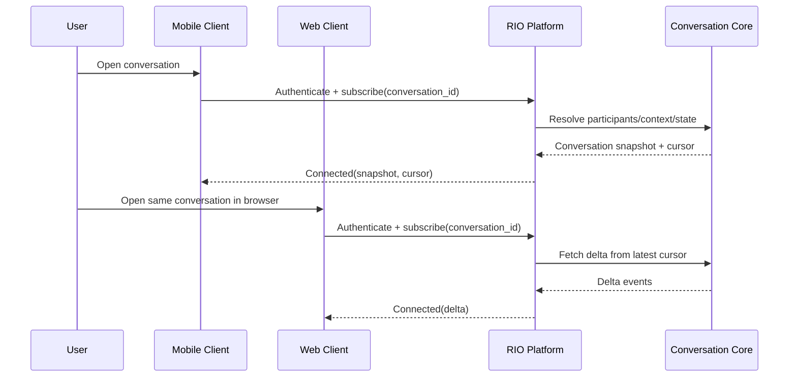
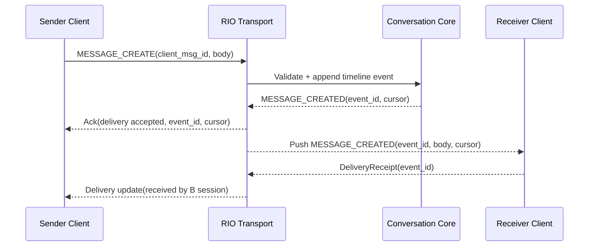
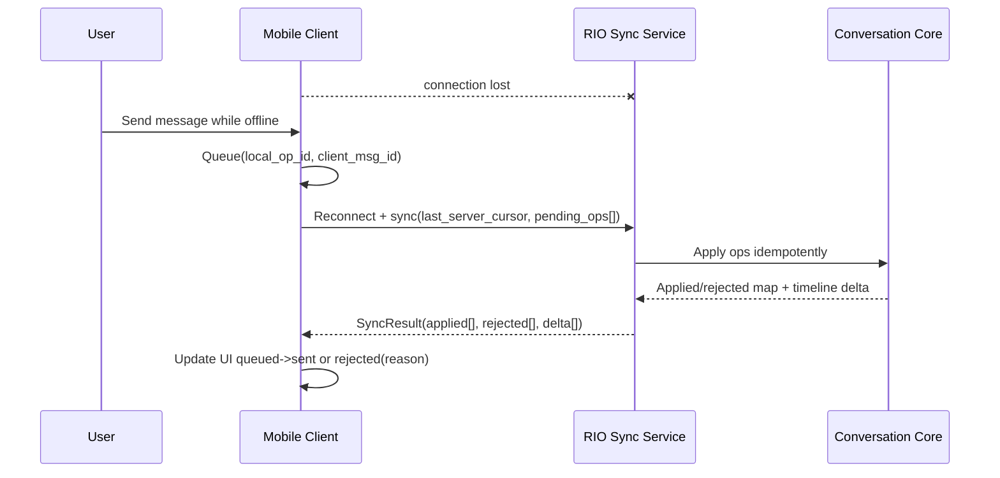
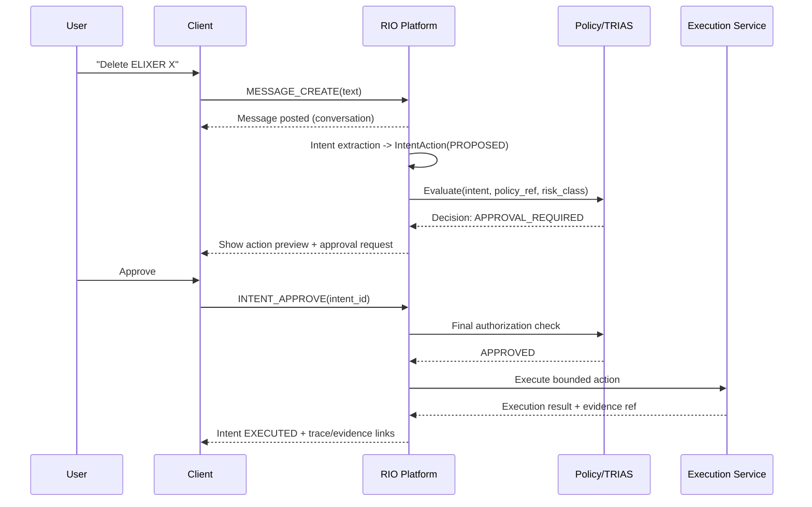
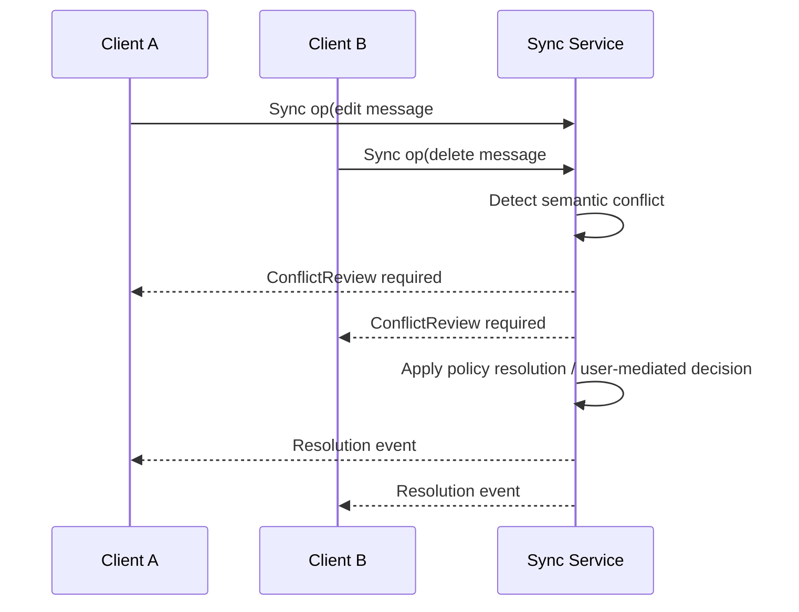

# RIO-SEQUENCE-DIAGRAMS-001
## Reference Sequence Diagrams v0.2

### Status
Draft v0.2

### Last Updated
2026-10-06

## 1) Discover → Connect (Cross-Surface)

## 2) Message Send & Realtime Delivery

## 3) Offline Queue → Sync

## 4) IntentAction Boundary (Message ≠ Action)

## 5) Optional: Conflict Review Branch

## Diagram usage note
These are reference flows. Implementations may vary in protocol detail, but **must preserve constitutional semantics and auditability**.
